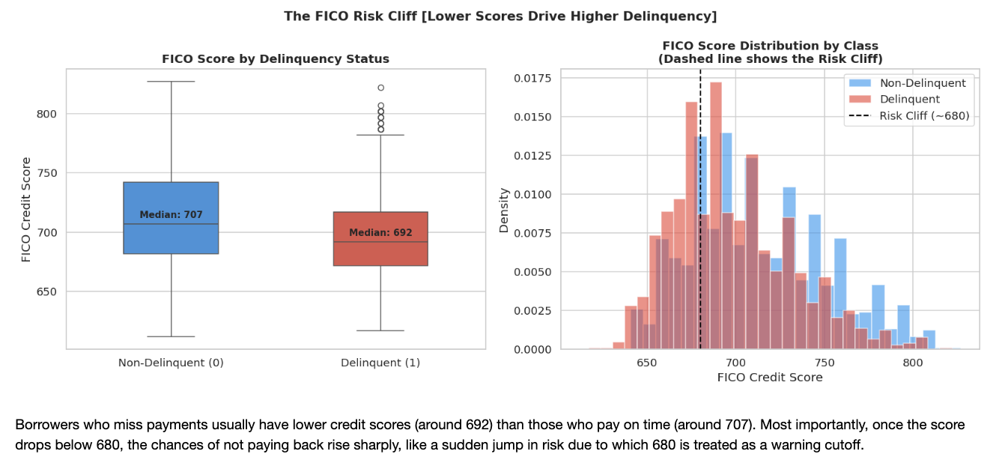

# Loan Delinquency Prediction

**A Data-Driven Framework for Retail Loan Risk Management** 

---

## 1. Project Overview

Banks face a common challenge: not all borrowers repay loans on time. Missed payments, or **delinquencies**, increase financial losses and portfolio risk.  

**Objective:** Predict which borrowers are likely to miss payments **before** it happens.  

A real-world loan dataset provides the basis for analysis. A model flags high-risk borrowers. Predictions include explanations of why a borrower is considered risky, supporting policy and regulatory compliance.

---

## 2. Dataset
The dataset contains 9,578 retail loan records sourced from a real-world lending portfolio, covering 14 variables per borrower. It includes a mix of financial attributes (credit score, income, debt-to-income ratio), loan characteristics (interest rate, payment amount, purpose), behavioural indicators (credit inquiries, past-due history, public records), and a binary target variable indicating whether the borrower became delinquent. 

* **Records:** 9,578 loans  
* **Features per borrower:** 13  

**Included features:**

- **Financial info:** income, debt-to-income ratio, FICO score  
- **Loan info:** interest rate, monthly payment, purpose  
- **Credit history:** credit age, recent credit applications, past late payments, public records  
- **Credit policy:** internal credit standard indicator  
- **Target:** delinquency (1 = yes, 0 = no)  

**Cleaned Data:**  9,489 records after removing 89 unrealistic records and duplicates. 
After removing 89 records with unrealistic debt-to-income values, the final working dataset contained 9,489 clean records with a class distribution of approximately 84% non-delinquent and 16% delinquent borrowers.

---

## 3. Key Observations

### 3.1 Borrower Payment Patterns

* 84% of borrowers paid on time  
* 16% became delinquent  

> Even one-in-five borrowers defaulting can have significant financial impact at scale.

### 3.2 Loan Purpose and Risk

| Loan Purpose        | Delinquency Rate |
|--------------------|-----------------|
| Small Business      | 27.7%           |
| Educational         | 19.6%           |
| Home Improvement    | 17.0%           |
| Debt Consolidation  | 15.2%           |
| Credit Card         | 11.6%           |
| Major Purchase      | 10.9%           |

> Small business loans triggered a higher risk.

### 3.3 FICO Risk Cliff

* FICO score ranges 300–850  
* Scores **below 680** indicate delinquency risk rises sharply

### 3.4 Behavioural Indicators

* Multiple recent **credit inquiries** - higher risk  
* Even **1–2 late payments** indicates increased risk  
* **Public records** (bankruptcies, court judgments) increased higher risk  

### 3.5 Interest Rate & Income

* Higher interest rates and lower income are contextual indicators, but not strong predictors alone  

---

## 4. Predictor Selection

* **Retained (10 features):** FICO score, interest rate, income, credit policy, payment size, credit line age, recent inquiries, times past due, public records, loan purpose  
* **Dropped (2 features):** debt-to-income ratio, revolving balance  

---

## 5. Model Development

### 5.1 Models Evaluated

* **Logistic Regression:** 
* **Decision Tree:** 
* **Random Forest:**  
* **XGBoost:**   

### 5.2 Evaluation Metrics

* **Recall (delinquent borrowers):** proportion of actual delinquents correctly identified  
* **ROC-AUC:** ability to rank borrowers by risk (0.5 = random, 1.0 = perfect)  

> Accuracy alone is misleading due to class imbalance (84% non-delinquent).

### 5.3 Model Performance

* **Random Forest:** 74% accuracy, low delinquent recall  
* **Logistic Regression:** balanced performance, higher delinquent recall → selected  

---

## 6. Selected Model: Logistic Regression

**Advantages:**

* Fully interpretable  
* Regulatory compliant  
* Highest recall for delinquent borrowers  
* Stable across multiple samples  

### 6.1 Threshold Adjustment

* Default probability threshold: 50%  
* Optimized threshold: 53.3% - better balance between true positives and false positives  
* ROC-AUC remains 0.674  

---

## 7. Risk Tiers

| Tier        | Probability | Actual Delinquency Rate |
| ----------- | ----------- | ---------------------- |
| Low Risk    | <30%        | 5.7%                    |
| Medium Risk | 30–55%      | 12.7%                   |
| High Risk   | >55%        | 26.7%                   |

> High Risk borrowers are **nearly 5 times more likely to default** than Low Risk.

---

## 8. Key Risk Drivers

1. **FICO Score** - higher score lowers risk  
2. **Recent Credit Inquiries** - more inquiries increase risk  
3. **Loan Interest Rate** - higher rate increases risk  
4. **Annual Income** - higher income lowers risk  
5. **Payment Size** - larger payments increase strain  

---

## 9. Small Business Loan Risk

Small business loans show a delinquency rate of 27.7%, nearly double the portfolio average. Standard retail credit models are not suited for the volatility of business income. This sub-project focuses on:

- Classification Model: Uses business-specific variables such as business age, sector, and revenue consistency instead of relying only on personal credit profiles.

- Survival Analysis: Applies a Cox Proportional Hazard model to predict time-to-default, enabling early intervention rather than just a binary yes/no prediction.

The shift to time-based prediction allows lending teams to act proactively and manage risk more effectively. 

---

## 10. Recommended Actions

1. Minimum **FICO ≥ 700** for small business loans  
2. Flag borrowers with **≥ 2 past-due events** for monitoring  
3. Adjust **interest rates or loan amounts** for borderline applicants  
4. Automate pre-approval for **Low Risk** borrowers (<30% probability)  

---

## 11. Summary

* End-to-end framework built for predicting loan delinquency  
* Logistic Regression: ROC-AUC 0.674, recall 55.6% for delinquents  
* Three-tier risk classification aligns with actual defaults  
* FICO Risk Cliff identified at 680  
* Small business loans flagged for dedicated follow-up  

---

## 12. Data Limitations

* Class imbalance (84% non-delinquent) : model biased toward majority  
* Low explanatory power (R² ≈ 5%) : many real-world factors not captured  
* No temporal or macroeconomic data : cannot detect trends or systemic risks  
* Static features only : richer data could improve predictive accuracy  
* Precision for delinquent borrowers: 26.8% : false positives exist  

---

## 13. Future Work

**Model Enhancements:**

* SHAP values for explanation of complex models  
* SMOTE for handling class imbalance  
* Calibrated ensembles (Logistic Regression + boosted models)  
* Hyperparameter optimization (GridSearchCV / Optuna)  

**Data & Feature Enhancements:**

* Time-series payment behavior  
* Macroeconomic variables (unemployment, interest rates)    

